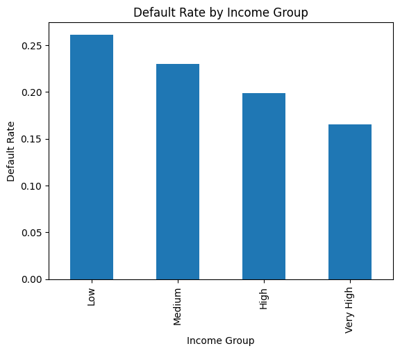

# Credit Risk Analysis & Default Risk Insights

## Project Overview
This project analyzes real-world loan data to identify factors associated with loan default risk using Python-based exploratory data analysis and visualization.

## Key Questions
- Does borrower income affect default risk?
- How does interest rate relate to default probability?
- Are certain loan purposes riskier than others?

## Tools Used
- Python (Pandas, Matplotlib, Seaborn)
- Jupyter / Google Colab

## Key Findings
- Default risk decreases as borrower income increases.
- Loans with higher interest rates show significantly higher default rates.
- Small business loans exhibit the highest default risk among loan purposes.

## Sample Visualizations

